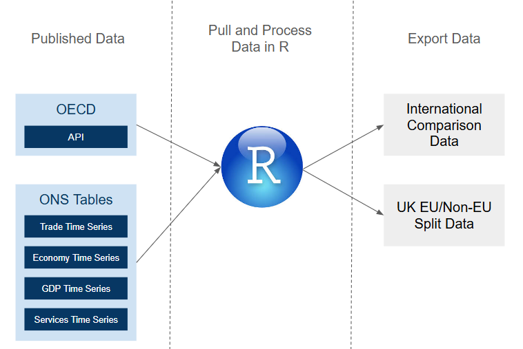

# G7 Trade Comparison

Automate G7 trade data flows using OECD API and ONS tables in R.

## Purpose

Trade data for different countries is updated according to each country's publication schedule. Comparing UK trade performance to that of other G7 countries previously required several manual updates when each country released data. 

This allows for automation of key charts and visuals as the data automatically updates. When deployed in an organisation the code would write the data to the server.

## How does it work?

The R code pulls the data from several sources including the OECD API and several ONS tables. The code then performs several operations, including joining data, indexing data and calculating new variables.

The diagram below shows the data flow:

